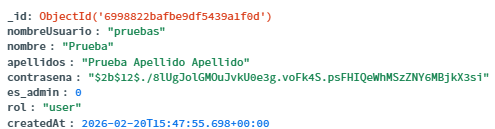

# Bcrypt para contraseñas

En este proyecto la contraseña **no se guarda en texto normal**.  
Cuando una persona se registra, la contraseña se transforma en un hash con `bcrypt` y ese hash es lo que se guarda en MongoDB.

Así, si alguien ve la base de datos, no verá la contraseña real.

## Cómo lo estoy usando

1. En el servidor importo `bcrypt`.
2. En `/registro` hago el hash con fuerza `12`.
3. En `/login` comparo la contraseña escrita con el hash guardado.

## Ejemplo literal: importación

```js
import bcrypt from 'bcrypt'
```

## Ejemplo literal: registro (guardar hash)

```js
const contrasenaHash = await bcrypt.hash(String(contrasena), 12)

const result = await usuariosCollection.insertOne({
  nombreUsuario: nombreUsuarioLimpio,
  nombre: nombreLimpio,
  apellidos: apellidosLimpio,
  contrasena: contrasenaHash,
  es_admin: 0,
  rol: 'user',
  createdAt: new Date(),
})
```

## Ejemplo literal: login (comparar contraseña)

```js
const contrasenaValida = await bcrypt.compare(
  String(contrasena),
  String(user.contrasena || '')
)

if (!contrasenaValida) {
  return res.status(401).json({ ok: false, error: 'Usuario o contrasena incorrectos' })
}
```

## Imagen del usuario con contraseña hasheada en MongoDB



---

# JWT para tokens

Con JWT hacemos algo simple:

1. El usuario inicia sesión con usuario y contraseña.
2. Si todo va bien, el servidor crea un token.
3. El frontend guarda ese token.
4. En las rutas protegidas, el frontend envía el token en `Authorization`.
5. El servidor valida el token antes de continuar.

## Cómo lo incorporamos en este proyecto

- En `POST /login` se genera el token y se devuelve junto con `user`.
- En `InicioView.vue` se guarda `token` en `localStorage`.
- En vistas como `ClasesView.vue`, `InscribirClaseView.vue` y `MisClasesView.vue` se envía `Authorization: Bearer ...`.
- En `server.js` se creó un middleware para validar el token.

## Ejemplo literal: crear token en login

```js
const token = jwt.sign(
  {
    sub: String(user._id),
    nombreUsuario: user.nombreUsuario,
    es_admin: esAdmin,
  },
  JWT_SECRET_KEY,
  { expiresIn: '7d' }
)

return res.json({
  ok: true,
  token,
  user: {
    id: String(user._id),
    nombreUsuario: user.nombreUsuario,
    es_admin: esAdmin,
  },
})
```

Explicación: si el login es correcto, se crea un token válido 7 días y se devuelve al frontend.

## Ejemplo literal: guardar token en el frontend

```js
function guardarTokenLocal(token) {
  localStorage.setItem("token", String(token || ""));
}

guardarTokenLocal(data.token);
```

Explicación: después del login, guardamos el token para usarlo en peticiones siguientes.

## Ejemplo literal: enviar token en una petición protegida

```js
const response = await fetch(url, {
  method: "POST",
  headers: {
    "Content-Type": "application/json",
    Authorization: `Bearer ${token.value}`,
  },
  body: JSON.stringify({ usuarioId: usuarioId.value }),
});
```

Explicación: el token viaja en la cabecera `Authorization` para que el servidor sepa quién hace la acción.

## Ejemplo validarl: validar token en el servidor

```js
function autenticarToken(req, res, next) {
  const authorization = String(req.headers?.authorization || '').trim()
  if (!authorization.toLowerCase().startsWith('bearer ')) {
    return res.status(401).json({ ok: false, error: 'Token no enviado' })
  }

  const token = authorization.slice(7).trim()

  try {
    req.auth = jwt.verify(token, JWT_SECRET_KEY)
    return next()
  } catch {
    return res.status(401).json({ ok: false, error: 'Token inválido o expirado' })
  }
}
```

Explicación: si el token no existe o no es válido, la ruta responde `401`.

## Ejemplo literal: ruta protegida con JWT

```js
app.post('/clases', autenticarToken, async (req, res) => {
  if (Number(req.auth?.es_admin) !== 1) {
    return res.status(403).json({ ok: false, error: 'No autorizado' })
  }
})
```

Explicación: primero se valida token y después se comprueba si el usuario es admin.

## Archivos Involucrados

- server/server.js
- src/views/InicioView.vue
- src/views/InscribirClaseView.vue
- src/views/MisClasesView.vue
- src/views/ClasesView.vue
- src/views/PerfilView.vue
